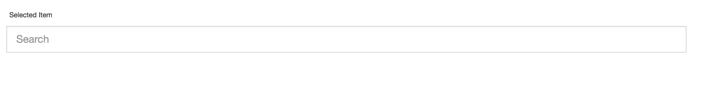
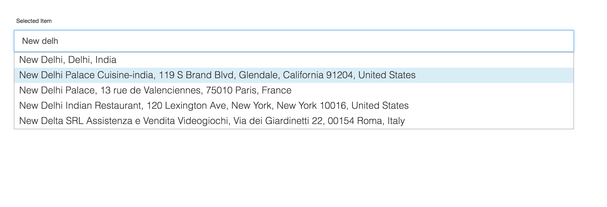
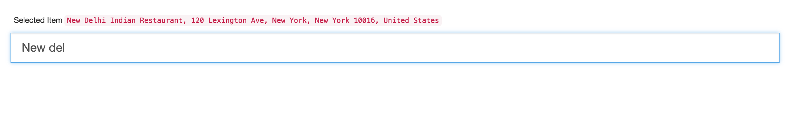

# Intro

 Auto complete input component with ReactJS and Mapbox.

## Datasource

I used [Mapbox Geocoding API](https://www.mapbox.com/api-documentation) as data source.

## Install & Run the Application

1. Go into the project folder.
2. Run `npm install` to download dependencies.
3. Run `npm start` to start development server.
4. Open `http://localhost:5555/`

## Screenshots

### Initial State of the Component

#### Showed Up Suggestions While Entering the Location

#### After Selection an Item

